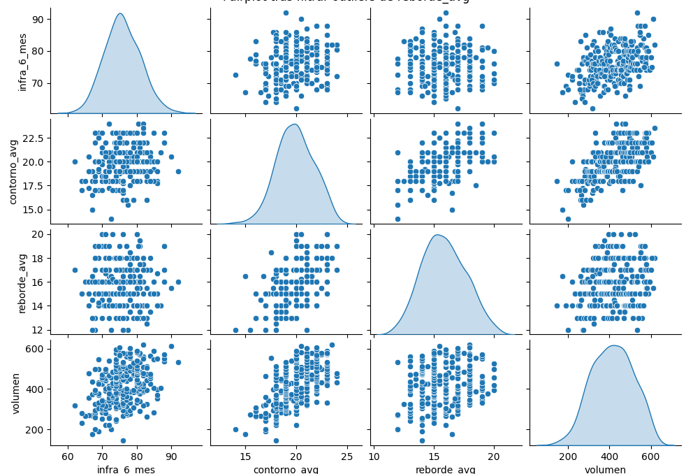
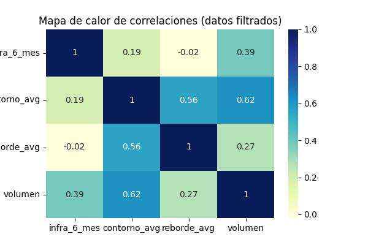
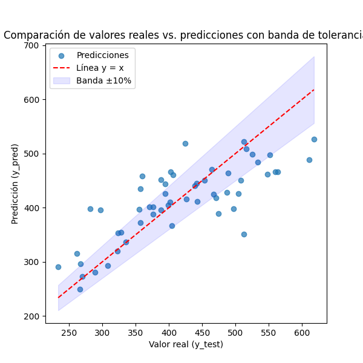

# Regresión polinómica multivariable (con las variables Inframamaria, Reborde y Contorno).

### Datos:
[Input de datos](datos_mezclados.csv)

### Graficas:

[Ver grafico 3D interactivo](mi_scatter_3d_interactivo.html)

## **Resultados:**

RMSE = 59.538

R^2  = 0.607

## Interpretacion:

**RMSE = 59.54**

* Un *RMSE* de \~60 cc quiere decir que, en promedio, la **desviación típica** entre el volumen real y el volumen estimado es de unos 60 cc.
* Para traducirlo: “Cuando predecimos el volumen mamario, solemos equivocarnos en torno a 60 cc arriba o abajo”.

**R² = 0.607**

* El *R²* indica la proporción de la variabilidad del volumen que el modelo está siendo capaz de explicar con esas variables (inframamaria, contorno y reborde).
* Un *R²* de 0.607 significa que **alrededor del 60%** de las diferencias en el volumen entre pacientes se explican por esas mediciones.
* No es un ajuste perfecto (para ello, querríamos un valor cercano a 1), pero muestra que más de la mitad de la variación se entiende con esas tres mediciones. El resto (cerca del 40%) puede deberse a otros factores no recogidos en el modelo.

---

### Explicación simplificada

* **El modelo no es perfecto**, pero logra explicar aproximadamente **el 60%** de lo que hace variar el volumen.
* El **error típico** es de alrededor de **60 cc** de diferencia entre el volumen real y el volumen estimado.
* **Siguiente paso**: Si se quiere más precisión, habría que considerar otras variables que influyan en el volumen o probar métodos/modelos diferentes para bajar ese error (o sea, reducir el *RMSE*) y aumentar el *R²*.
